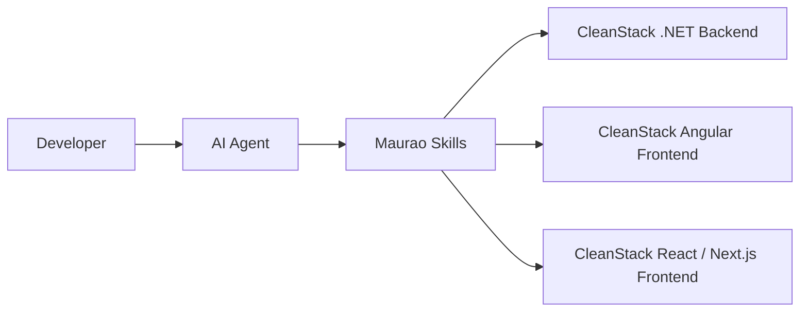

# Maurao Skills

Reusable AI Agent Skills for .NET, Angular, React, software architecture and developer workflows.

Designed as the companion skill collection for [CleanStack](https://github.com/luismpenholato/clean-stack), while remaining adaptable to projects with similar architectures.

[](https://github.com/luismpenholato/maurao-skills/actions/workflows/validate-skills.yml)
[](LICENSE)
[](https://github.com/sponsors/luismpenholato)

## About

**Maurao Skills** is a local-first collection of Markdown-based [Agent Skills](https://skills.sh) that teach AI agents how to build and maintain software using proven Clean Architecture patterns.

Each skill encodes real conventions from [CleanStack](https://github.com/luismpenholato/clean-stack) — vertical slices, CQRS, typed frontends, and automated tests — so agents produce consistent, reviewable code instead of generic boilerplate.

The repository stays intentionally simple: no web app, no npm package, no runtime framework. Skills are plain files you install, reference, or copy into your workspace.

## CleanStack companion

[CleanStack](https://github.com/luismpenholato/clean-stack) provides the executable fullstack starter (backend, frontends, Docker, CI). **Maurao Skills** provides reusable instructions that agents follow when working on those projects — or on similar architectures with adaptation.

| CleanStack area | Skill |
|---|---|
| .NET backend | `dotnet-backend-clean-architecture` |
| Angular frontend | `angular-frontend-clean-architecture` |
| React / Next.js frontend | `react-nextjs-antd-clean-architecture` |



## Available skills

| Skill | Target | Main use cases |
|---|---|---|
| [dotnet-backend-clean-architecture](skills/dotnet-backend-clean-architecture/) | .NET 10 | .NET 10 APIs using Clean Architecture, CQRS, MediatR, FluentValidation, EF Core, FluentMigrator, Refit and automated tests. |
| [angular-frontend-clean-architecture](skills/angular-frontend-clean-architecture/) | Angular 21 | Angular 21 standalone applications using signals, vertical slices, OnPush, ng-zorro and Vitest. |
| [react-nextjs-antd-clean-architecture](skills/react-nextjs-antd-clean-architecture/) | React 19 / Next.js 16 | React 19 and Next.js 16 applications using App Router, Ant Design, TanStack Query, React Hook Form, Zod and Vitest. |

## Installation

Requirement: [Node.js](https://nodejs.org/) 20+ (to use `npx`).

The exact installation destination and supported flags depend on the Agent Skills CLI and the target agent.

### List skills in the repository

```bash
npx skills add luismpenholato/maurao-skills --list
```

### Install a skill

```bash
# .NET backend
npx skills add luismpenholato/maurao-skills --skill dotnet-backend-clean-architecture

# Angular frontend
npx skills add luismpenholato/maurao-skills --skill angular-frontend-clean-architecture

# React + Next.js frontend
npx skills add luismpenholato/maurao-skills --skill react-nextjs-antd-clean-architecture
```

To install globally and/or for a specific agent, use the flags shown by the CLI (e.g., `--global`, `--agent`). Not every agent supports automatic installation — see [Compatibility](#compatibility).

Installation is done directly from this GitHub repository; [skills.sh](https://skills.sh) may have its own catalog/indexing and not every public repo appears there.

## Usage examples

Short prompts and the behavior agents should follow when the matching skill is active.

### Backend (.NET)

**Prompt:**

> Use the dotnet-backend-clean-architecture skill to add an Orders feature with create, update, list and get-by-id operations, including validation, migration and unit tests.

**Expected behavior:**

The agent should follow the CleanStack project boundaries, create Commands and Queries per feature, register dependencies and add tests.

### Angular

**Prompt:**

> Use the angular-frontend-clean-architecture skill to create an Orders listing and form using Angular 21, signals, OnPush and ng-zorro.

**Expected behavior:**

The agent should create a vertical slice under `pages/orders/` with model, service, list and form components, wire routes in `app.routes.ts`, and use OnPush with signals.

### React / Next.js

**Prompt:**

> Use the react-nextjs-antd-clean-architecture skill to create an Orders feature using Next.js App Router, Ant Design, TanStack Query, React Hook Form and Zod.

**Expected behavior:**

The agent should create a feature under `src/features/orders/` with types, schema, service, hooks and page, add a thin route in `src/app/`, and keep HTTP centralized in `shared/lib/api/`.

## Compatibility

Compatibility depends on each agent's support for Agent Skills or repository-based instructions.

| Agent / tool | Expected usage |
|---|---|
| Cursor | Install or reference the skill in the project workspace |
| Codex | Use the skill as repository or task context |
| Claude Code | Use when Agent Skills-compatible installation is available |
| Other agents | Copy or reference the relevant `SKILL.md` manually |

## Repository structure

```txt
maurao-skills/
├── .github/
│   ├── workflows/validate-skills.yml
│   ├── ISSUE_TEMPLATE/
│   ├── FUNDING.yml
│   └── pull_request_template.md
├── scripts/
│   └── validate-skills.mjs
├── skills/
│   ├── dotnet-backend-clean-architecture/
│   │   ├── SKILL.md
│   │   └── reference.md
│   ├── angular-frontend-clean-architecture/
│   │   ├── SKILL.md
│   │   └── reference.md
│   └── react-nextjs-antd-clean-architecture/
│       ├── SKILL.md
│       └── reference.md
├── CHANGELOG.md
├── CODE_OF_CONDUCT.md
├── CONTRIBUTING.md
├── LICENSE
├── package.json
├── README.md
└── SECURITY.md
```

Each skill lives in a folder with `SKILL.md` (YAML frontmatter + instructions). Files in `reference.md` hold long examples, tables, and flows.

## Validation

The repository includes an automated validator that checks skill structure, frontmatter, duplicate names, local Markdown links, and empty files.

```bash
npm ci
npm run validate
```

CI runs the same validation on every push and pull request to `main` via the [Skills Validation](.github/workflows/validate-skills.yml) workflow.

## Contributing

See [CONTRIBUTING.md](CONTRIBUTING.md) for skill structure, content standards, and the pull request checklist.

## Security

See [SECURITY.md](SECURITY.md) to report malicious content, prompt injection, or unsafe instructions. Do not open public issues for security-sensitive reports.

## Support

- [Issues](https://github.com/luismpenholato/maurao-skills/issues) for bugs, corrections and skill requests
- [GitHub Sponsors](https://github.com/sponsors/luismpenholato) to support ongoing maintenance

## License

[MIT](LICENSE) — free to use, modify, and distribute. Keep the copyright and license notice.
